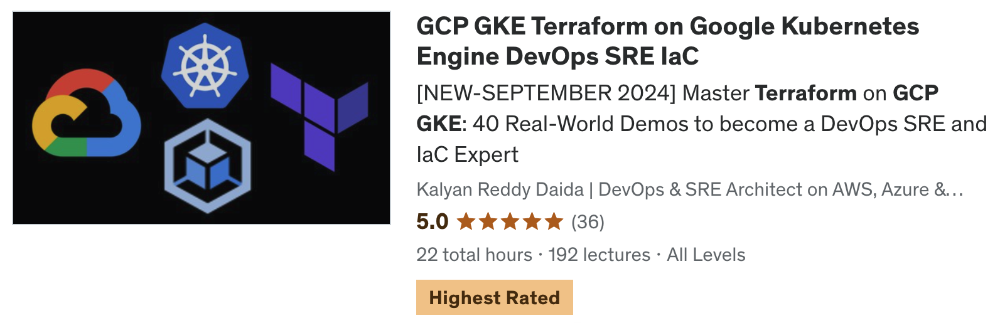

# [GCP GKE Terraform on Google Kubernetes Engine DevOps SRE IaC - 40 Real-World Demos](https://links.stacksimplify.com/gcp-gke-terraform-on-google-kubernetes-engine)

## [Course Details](https://links.stacksimplify.com/gcp-gke-terraform-on-google-kubernetes-engine)
- **Title:** [GCP GKE Terraform on Google Kubernetes Engine DevOps SRE IaC - 40 Real-World Demos](https://links.stacksimplify.com/gcp-gke-terraform-on-google-kubernetes-engine)
- **Sub Title:** Master Terraform on GCP GKE: 40 Real-World Demos to become a DevOps SRE and IaC Expert

## [Course Modules](https://links.stacksimplify.com/gcp-gke-terraform-on-google-kubernetes-engine)
1. **Demo-01:** Install CLI Tools: gcloud CLI, Terraform CLI, VSCode Editor
2. **Demo-02:** Terraform Commands (init, validate, plan, apply and destroy)
3. **Demo-03:** Terraform Language Basics
4. **Demo-04:** Terraform Meta-Argument - Provider (Multiple Providers Demo)
5. **Demo-05:** Terraform Input Variables and Output Values
6. **Demo-06:** Terraform Meta-argument: count
7. **Demo-07:** Terraform Datasources
8. **Demo-08:** Terraform Meta-argument: for_each
9. **Demo-09:** GKE Public Standard Cluster
10. **Demo-10:** Kubernetes Resources using YAML Manifests
11. **Demo-11:** Kubernetes Resources using Terraform Manifests
12. **Demo-12:** GKE Private Standard cluster with Cluster Autoscaler
13. **Demo-13:** GKE Horizontal Pod Autoscaling
14. **Demo-14:** GKE Vertical Pod Autoscaling
15. **Demo-15:** GKE Private Standard Cluster with Private Endpoint
16. **Demo-16:** GKE Private Autopilot cluster
17. **Demo-17:** GKE Storage: Compute Engine Persistent Disk CSI Driver
18. **Demo-18:** GKE Storage: Cloud SQL MySQL Database
19. **Demo-19:** GKE Storage: Cloud Storage with FUSE CSI Driver
20. **Demo-20:** GKE Storage: Filestore CSI Driver
21. **Demo-21:** GKE Gateway API (GCP Regional Application Load Balancer)
    - **Demo-21-01:** GKE Gateway API Basics (Gateway and HTTPRoute)
    - **Demo-21-02:** GKE Gateway API Static IP (GCP External IP Address)
    - **Demo-21-03:** GKE Gateway API self-signed SSL (Kubernetes Secrets)
    - **Demo-21-04:** GKE Gateway API self-signed SSL (GCP Certificate Manager)
    - **Demo-21-05:** GKE Gateway API HTTP to HTTPS Redirect
    - **Demo-21-06:** GKE Gateway API Context path-based Routing
    - **Demo-21-07:** GKE Gateway API Domain name Routing
    - **Demo-21-08:** GKE Gateway API Traffic Splitting
    - **Demo-21-09:** GKE Gateway API Health check and Session Affinity (GKE custom policies)
    - **Demo-21-10:** Cloud Domains and Cloud DNS
    - **Demo-21-11:** GKE Gateway API Production grade SSL (GCP Certificate Manager + Cloud DNS + Cloud Domains)
    - **Demo-21-12:** GKE Gateway API Production grade SSL (GCP Certificate Manager + Cloud DNS + AWS Route53)
    - **Demo-21-13:** GKE Gateway API Global LB (GCP Global Application Load Balancer)
22. **Demo-22:** Use Pre-built Terraform Modules from Terraform Registry
23. **Demo-23:** GKE Infra: Create custom GKE Terraform Module
24. **Demo-24:** GKE Infra DevOps using GitHub and GCP Cloud Build
25. **Demo-25:** GKE Workloads: Create custom Kubernetes Deployment Terraform Module
26. **Demo-26:** GKE Workload DevOps using GitHub and GCP Cloud Build
27. **Demo-27:** GKE App: Implement Continuous Integration with GitHub, Cloud Build and GCP Artifact Registry
28. **Demo-28:** GKE App: Implement Continuous Delivery using GitHub and Cloud Build

## [Terraform Concepts covered](https://links.stacksimplify.com/gcp-gke-terraform-on-google-kubernetes-engine)
1. Terraform Commands  
2. Terraform Providers  
3. Terraform Settings Block  
4. Terraform Resources  
5. Terraform Local Backends  
6. Terraform Remote Backends  
7. Terraform Input Variables  
8. Terraform Output Values  
9. Terraform Local Values  
10. Terraform Remote State Datasource  
11. Terraform Template Functions  
12. Terraform Meta-argument Provider  
13. Terraform Meta-argument count  
14. Terraform Meta-argument for_each  
15. Terraform Datasources  
16. Terraform Public Modules  
17. Terraform Custom Modules Development  
18. Terraform Functions  

## [GCP Services](https://links.stacksimplify.com/gcp-gke-terraform-on-google-kubernetes-engine)
1. Google Compute Engine VM Instances  
2. Google Compute Engine Health Checks  
3. Google Compute Engine Persistent Disks  
4. Google Cloud VPC  
5. Google Cloud Firewalls  
6. Google Cloud Storage  
7. Google Cloud Monitoring  
08. Google Cloud Logging  
09. Google Cloud Load Balancing  
10. Google Cloud IAM  
11. Google Cloud Domains  
12. Google Cloud DNS  
13. Google Cloud NAT  
14. Google Cloud Router  
15. Google Cloud External IP  
16. Google Cloud Build  
17. Google Cloud Certificate Manager  
18. Google VPC Private Service Connection
19. Google Kubernetes Engine
20. GCP Secrets Manager
21. GCP Cloud Storage Buckets

## [Kubernetes Concepts](https://links.stacksimplify.com/gcp-gke-terraform-on-google-kubernetes-engine)
01. Google Kubernetes Engine - Standard Public Cluster
02. Google Kubernetes Engine - Standard Private Cluster
03. Google Kubernetes Engine - Autopilot Cluster
04. Kubernetes Cluster Autoscaler
05. Kubernetes Horizontal Pod Autoscaling
06. Kubernetes Vertical Pod Autoscaling
07. Kubernetes Deployments
08. Kubernetes Load Balancer Service
09. Kubernetes Storage - Storage Classes
10. Kubernetes Storage - Persistent Volumes
11. Kubernetes Storage - Persistent Volume Claims
12. Kubernetes Secrets
13. Kubernetes Gateway API (Load Balancers - 13 Important Demos )

## [What will students learn in your course?](https://links.stacksimplify.com/gcp-gke-terraform-on-google-kubernetes-engine)
1. You will learn Terraform basics with first 8 practical demos
2. You will learn to automate GKE standard public cluster with terraform
3. You will learn to automate GKE standard private clsuter with cluster autoscaler
4. You will learn to automate GKE standard private cluster with private endpoint
5. You will learn to implemnent autoscaling features like cluster autoscaler, horiztontal and vertical pod autoscaling 
6. You will learn to automate GKE autopilot private clsuter with terraform
7. You will learn to automate GKE Storage: GCP Compute Engine Persistent Disk CSI Driver
8. You will learn to automate GKE Storage: GCP Cloud Storage FUSE CSI Driver
9. You will learn to automate GKE Storage: GCP Filestore CSI Driver
10. You will learn to automate GKE Gateway API: Static IP with GCP External IP Address
11. You will learn to automate GKE Gateway API: Self-signed SSL certs with Kubernetes Secrets
12. You will learn to automate GKE Gateway API: Self-signed SSL certs with GCP Certificate Manager
13. You will learn to automate GKE Gateway API: HTTP to HTTPS Redirect
14. You will learn to automate GKE Gateway API: Context Path-based Routing
15. You will learn to automate GKE Gateway API: Domain name based Routing
16. You will learn to automate GKE Gateway API: Traffic Splitting
17. You will learn to automate GKE Gateway API: Health checks and Session Affinity
18. You will learn to master services like GCP Cloud Domains and Cloud DNS
19. You will learn to automate GKE Gateway API: Production grade SSL with Cloud DNS and Cloud Domains
20. You will learn to automate GKE Gateway API: Production grade SSL with Cloud DNS and AWS Route53
21. You will learn to automate GKE Gateway API: GCP Global Application Load Balancer
22. You will learn to automate GKE Gateway API: GCP Regional Application Load Balancer
23. You will learn to use pre-built Terraform modules from Terraform Registry
24. You will build GKE Cluster custom terraform module
25. You will implement GKE Infra devops where we can create multiple GKE environments dev, production using Cloud Build Triggers (Pipelines)
26. You will build Kubernetes Deployment custom terraform module
27. You will implement continuous integration for a sample application using GitHub, Cloud Build and GCP Artifact Registry
27. You will implement GKE Workload devops where we can deploy our dev applications to Dev GKE cluster and prod applications to prod GKE cluster using GitHub and Cloud Build (Pipelines)

## [What are the requirements or prerequisites for taking your course?](https://links.stacksimplify.com/gcp-gke-terraform-on-google-kubernetes-engine)
- You need to have basic knowledge of Google Cloud Platform and Kubernetes concepts
- To create Google Cloud Account, you need a debit or credit card 
- You don't need any prior knowledge of Terraform. We will start from the very basics of Terraform. The first 8 demos will focus on Terraform fundamentals.

## [Who is this course for?](https://links.stacksimplify.com/gcp-gke-terraform-on-google-kubernetes-engine)
- This course is designed for students who are planning to automate Google Kubernetes Engine Infrastructure using Terraform
- Students who planning to learn Terraform on Google Cloud Platform and Google Kubernetes Engine
- Students who are planning to master DevOps, SRE (Site Reliability Engineerig) and IaC (Infrastructure as Code) concepts using Terraform, Google Cloud and Google Kubernetes Engine, Cloud Build and GitHub

## [Github Repositories used for this course](https://links.stacksimplify.com/gcp-gke-terraform-on-google-kubernetes-engine)
- [terraform-on-google-kubernetes-engine](https://github.com/stacksimplify/terraform-on-google-cloud)
- [terraform-gcp-gke-infra-devops](https://github.com/stacksimplify/terraform-gcp-gke-infra-devops)
- [terraform-gcp-gke-k8s-devops](https://github.com/stacksimplify/terraform-gcp-gke-k8s-devops)
- [terraform-gcp-gke-app-devops](https://github.com/stacksimplify/terraform-gcp-gke-app-devops)
- [Course Presentation](https://github.com/stacksimplify/terraform-on-google-kubernetes-engine/tree/main/course-presentation)
- **Important Note:** Please go to these repositories and FORK these repositories and make use of them during the course.

## [Each of my courses come with](https://links.stacksimplify.com/gcp-gke-terraform-on-google-kubernetes-engine)
- Amazing Hands-on Step By Step Learning Experiences
- Practical demos for each and every concept
- Friendly Support in the Q&A section
- "30-Day "No Questions Asked" Money Back Guaranteed by Udemy"

## My Other GCP (Google Cloud Courses)
### [GCP Terraform on Google Cloud:DevOps SRE 30 Real-World Demos](https://links.stacksimplify.com/gcp-terraform-on-google-cloud-devops-sre-iac)

### [GCP Associate Cloud Engineer Google Certification -150 Demos](https://links.stacksimplify.com/gcp-associate-cloud-engineer-google-certification)

### [GCP GKE Google Kubernetes Engine DevOps 75 Real-World Demos](https://links.stacksimplify.com/gcp-google-kubernetes-engine-gke-with-devops)

## My Other AWS Courses
- [Udemy Enroll](https://www.stacksimplify.com/azure-aks/courses/stacksimplify-best-selling-courses-on-udemy/)

## Stack Simplify Udemy Profile
- [Udemy Profile](https://www.udemy.com/user/kalyan-reddy-9/)

# HashiCorp Certified: Terraform Associate - 50 Practical Demos
 

# AWS EKS - Elastic Kubernetes Service - Masterclass

# Azure Kubernetes Service with Azure DevOps and Terraform 

# Terraform on AWS with SRE & IaC DevOps | Real-World 20 Demos

# Azure - HashiCorp Certified: Terraform Associate - 70 Demos

# Terraform on Azure with IaC DevOps and SRE | Real-World 25 Demos

# [Terraform on AWS EKS Kubernetes IaC SRE- 50 Real-World Demos](https://links.stacksimplify.com/terraform-on-aws-eks-kubernetes-iac-sre)

# [Helm Masterclass: 50 Practical Demos for Kubernetes DevOps](https://links.stacksimplify.com/helm-masterclass-kubernetes-devops)

